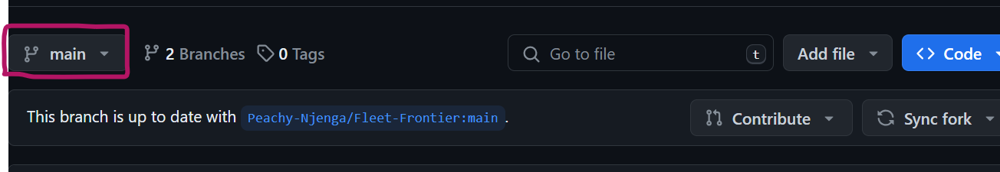
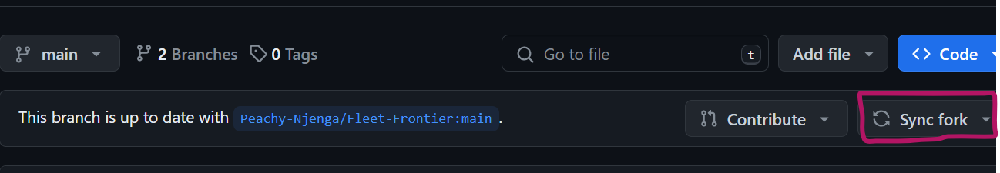
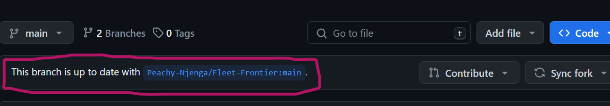

## FLEET FRONTIER
## Updating your Fork
1. Go to your fork and make sure you are on the main branch

2. Click on the sync fork button and update the branch

3. It should now read that your branch is up to date with ...

4. Navigate to where the project exists in your computer and change to the main branch by running.
```bash
git checkout main
```
5. Now run the following command to update your local repository.
```bash
git pull 
```
### Database configuration
1. Assuming you have docker installed ...run the following comand to pull the mysql image
```bash
  docker pull mysql
```
2. After the download is complete run the following command to start an instance of the image
```bash
docker run --name fleet-frontier-server -e MYSQL_ROOT_PASSWORD=default123 -p 33062:3306 -d mysql
```
3. Ensure the container ``fleet-frontier-server`` is running and connect it to either mysql workbench or your favourite software to run the sql commands.

 **NB:Make sure you use the server as localhost, port as 33062, username as root and password as default123**


4. After connecting it successfully open the [db_config](./db_config/) folder and run the commands in [fleet_finder.sql](./db_config/fleet_finder.sql) to create the database and populate it with sample data by running the commands in [sample_data.sql](./db_config/sample_data.sql) in the software you connected the server to.

5. It is recommended that if you previously had created and populated the database that you drop it first and create it again because there have been some updates to the commands.For this you will need to run
```sql
DROP DATABASE fleet_finder;
```

6. You will need to run a sql command to create a user for login purposes
```sql
USE fleet_finder;
INSERT INTO user(username, password) VALUES ('<your_username>', '<your_password>');
``` 
7. Now open the solution in visual studio and run it...hopefully it works :sparkles: &#x1F480;